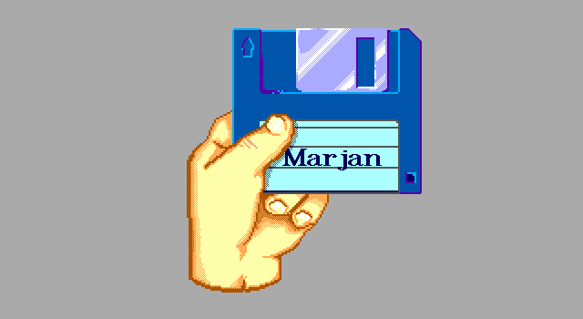

# Marjan
This is the repository of an old DOS program I wrote back in 1990, called Marjan.
The purpose of the program is to help with managing your personal software catalog.
It was distributed as freeware; when people liked it, they could make a donation.
The language is Clipper, an xBase compiler that implements a variant of the xBase computer programming language.
It uses dBase IV structured .dbf files for storage and .ntx for indexing. The reports were created using Crystal Reports (.rp1).

