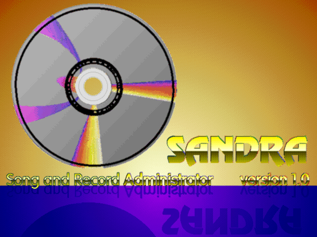
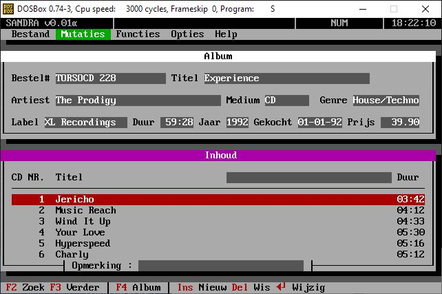

# Sandra
This is the repository of the work-in-progress of an old DOS project I wrote back in 1992, called Sandra.
The purpose of the program is to help with managing your personal music catalog.
The language is Clipper, an xBase compiler that implements a variant of the xBase computer programming language.
It uses dBase IV structured .dbf files for storage and .ntx for indexing. The reports were created using Crystal Reports (.rp1).

